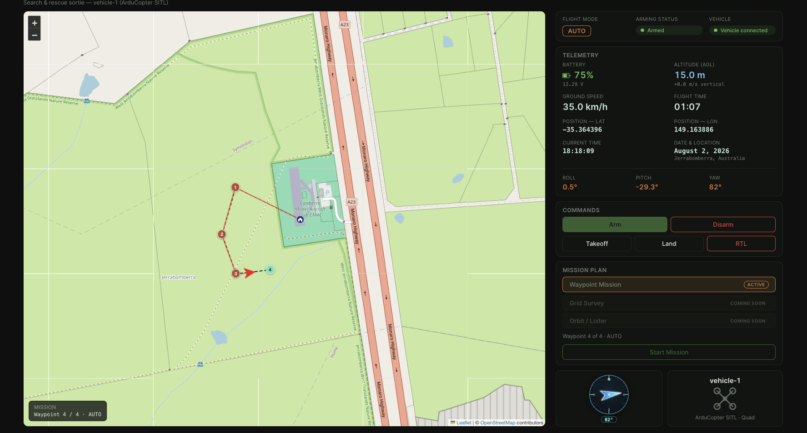
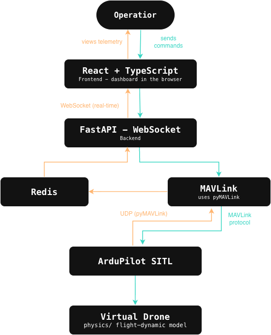

# SAR Mission Control — Drone Control & Monitoring System

A prototype Ground Control Station (GCS) for a single simulated drone,
framed as a Search & Rescue (SAR) sortie monitor. A simulated ArduCopter
(ArduPilot SITL) stands in for a drone searching a disaster-struck area for
survivors. An operator watches live telemetry and issues flight commands —
including a full multi-waypoint mission — from a web dashboard.

## Demo

[Demo video](https://youtu.be/BnwONeTowAk)

## Scenario

After a disaster (flood, earthquake, etc.) roads may be impassable and the
search area too large to cover on foot quickly. A SAR team launches a drone
to fly a search pattern over the affected area while an operator at a
laptop monitors the vehicle's health and position in real time, and can
command an emergency Return-to-Launch if battery runs low, connection
degrades, or the sortie needs to abort.

## Architecture

- **Backend** (FastAPI): a background thread owns the MAVLink connection to
  SITL end-to-end — it reads telemetry and sends commands (pymavlink
  connections aren't safe to share across threads). Telemetry is normalized
  and published to Redis (pub/sub channel + latest-state cache). A
  WebSocket endpoint fans that out to any number of connected browsers.
  REST endpoints enqueue commands to the background thread and return the
  real MAVLink `COMMAND_ACK` result.
- **Redis**: decouples MAVLink ingestion from WebSocket delivery, lets
  multiple browser tabs subscribe without each opening their own MAVLink
  connection, and caches the latest state so a newly-connected client isn't
  left blank.
- **Frontend**: React + Vite + TypeScript, live-updating dashboard
  connected via WebSocket, plus a Leaflet map for mission planning and
  live vehicle tracking.

See `docs/ARCHITECTURE.md` for the full design rationale and
`docs/RUNBOOK.md` for a manual verification checklist.

## Tech stack

**Backend** (`backend/`)
- [FastAPI](https://fastapi.tiangolo.com/) + [Uvicorn](https://www.uvicorn.org/) — REST + WebSocket server
- [pymavlink](https://github.com/ArduPilot/pymavlink) — MAVLink protocol client to ArduCopter SITL
- [Redis](https://redis.io/) (`redis-py`) — pub/sub + latest-state cache between MAVLink ingestion and WebSocket delivery
- [Pydantic](https://docs.pydantic.dev/) — telemetry/command schemas and validation

**Frontend** (`frontend/`)
- [React](https://react.dev/) 18 + [TypeScript](https://www.typescriptlang.org/)
- [Vite](https://vite.dev/) — dev server and build
- [Leaflet](https://leafletjs.com/) — used directly (no `react-leaflet` wrapper) for the mission-planning and live-tracking map
- Hand-rolled CSS (custom properties + utility classes) — no CSS framework or component library

**Simulated vehicle**
- [ArduPilot SITL](https://ardupilot.org/dev/docs/sitl-simulator-software-in-the-loop.html) running ArduCopter, driven over MAVLink/UDP
- [MAVProxy](https://ardupilot.org/mavproxy/) — relays the SITL vehicle's MAVLink link to the backend's UDP port

## Features

Dashboard:
- Connection status, battery level, GPS position, altitude, flight mode,
  armed/disarmed status, roll/pitch/yaw and vertical speed
- Commands: **Arm**, **Disarm**, **Takeoff** (flies straight to a default
  10 m), **Land** (descends straight down at the vehicle's current
  position), **Return to Launch** (RTL — holds current altitude on the way
  home, then descends once over the launch point)
- **Waypoint Mission** planning: click multiple points on the map to build
  an ordered route, set altitude, optionally add "Return to Home", then
  upload and fly it in AUTO mode — see below

### Return to Launch

By default ArduCopter's RTL first climbs to a minimum altitude (~15 m)
before flying home. The backend forces `RTL_ALT_M`/`RTL_ALT` to 0 on every
connect (confirmed via the `PARAM_VALUE` echo), which tells ArduCopter to
hold whatever altitude it's already at instead — RTL flies straight back to
the launch point at the current altitude, then descends and lands once
over it.

### Waypoint Mission

Flow: toggle **"Waypoint Mission"** on → click points on the map to add
ordered waypoints (each carries the current altitude input) → optionally
enable **"Return to Home"** → **Start Mission**.

Under the hood this uploads a real multi-waypoint route via the MAVLink
mission protocol (`MISSION_COUNT` → `MISSION_REQUEST_INT`/`MISSION_ITEM_INT`
→ `MISSION_ACK`) and switches the vehicle to `AUTO`, rather than the older
single-point "fly to and hold" GUIDED command. If the vehicle is still on
the ground, a `NAV_TAKEOFF` item is inserted automatically before your
first waypoint. With "Return to Home" enabled, a trailing
`MAV_CMD_NAV_RETURN_TO_LAUNCH` item makes the vehicle fly home and land on
its own after the last waypoint.

## Quick start

Four processes, in four terminals — see `docs/RUNBOOK.md` for full
first-time setup, manual commands, and a verification checklist.

1. **Redis** — `scripts/start_redis.sh`
2. **ArduPilot SITL** — `scripts/start_sitl.sh` (run in its own Terminal
   window; opens real GUI windows, so not over SSH/headless)
3. **Backend** — `scripts/start_backend.sh`, then verify with
   `curl http://localhost:8000/health`
4. **Frontend** — `scripts/start_frontend.sh`, then open
   **http://localhost:5173**

## Known ArduCopter/SITL behavior (not bugs)

- The vehicle **auto-disarms** on the ground after a period of no stick
  input, and again shortly after RTL/AUTO lands — this is ArduCopter's own
  safety logic (`DISARM_DELAY`).
- Arm can be rejected with `MAV_RESULT_FAILED` for a short cooldown right
  after landing — a real ArduCopter arming check, not a backend bug.

## Further reading

- `docs/ARCHITECTURE.md` — full data flow and design rationale (why Redis,
  why pymavlink, why a single background thread)
- `docs/RUNBOOK.md` — manual verification checklist with expected output
  in both MAVProxy and the dashboard
- `CLAUDE.md` — implementation notes and ArduCopter-specific gotchas for
  anyone modifying `mavlink_client.py`
